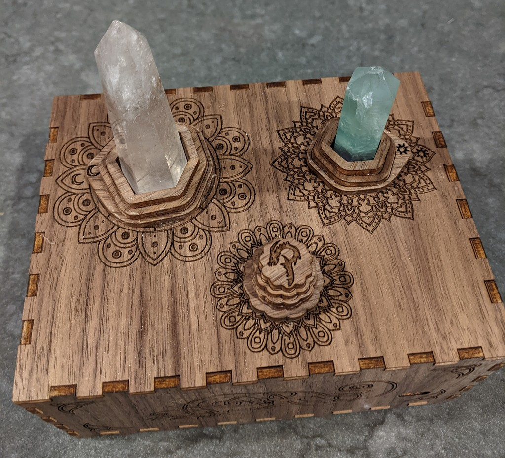
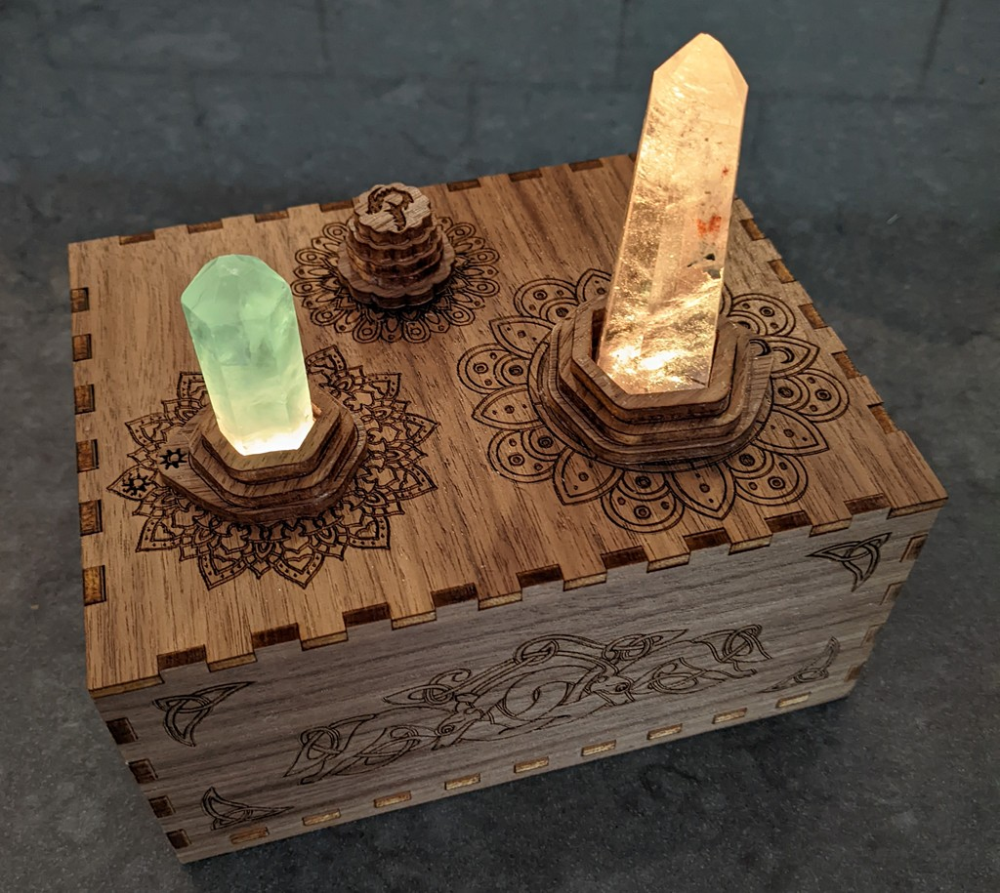
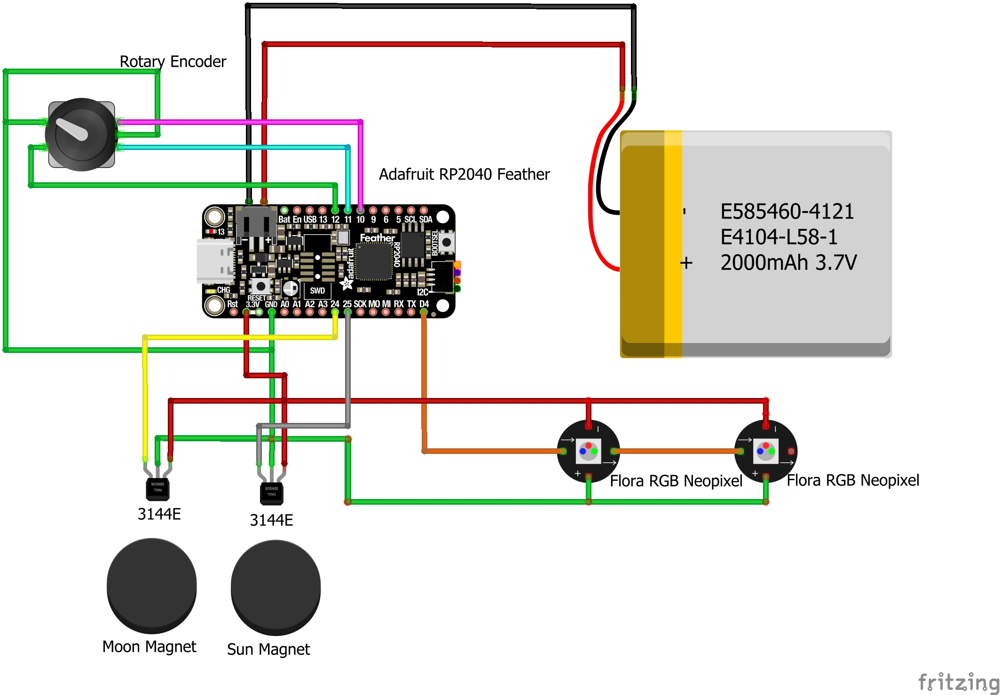
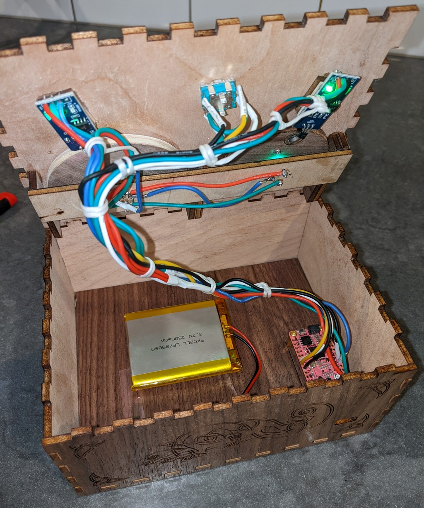

# RP2040 Glowing Crystals
Laser cut box for my toddlers favorite crystals with some RP2040 powered LEDs to illuminate them.

He has a magpie's eye for shiny things and is particularly fond of two quartz crystals he found at a flea market.
But a small boy's "love" is not a good match for quartz, and they were starting to show the wear and tear from his handling.
So I decided to make a little display to hold them.
` `  
` `  

` `  
` `  
Then feature creep took hold, and I thought I'd laser cut a box and have some LEDs to light up the crystals.

As he loves magical tales and mysteries I decided it would be good to have some symbols on the box that had to be aligned to make the crystal glow.

So now the crystals sit in rotatable sections above some red-green-blue LEDs. The rotating sections have embedded magnets, such that aligning the moon and/or sun symbols trigger hall-effect sensors.
These then start the led show, either glowing white, or cycling through a rainbow effect.

A rotary encoder is hidden under some more laser cut pieces and allow the colours to be manually selected.
` `  
` `  

` `  
` `  
An Adafruit RP2040 feather board, powered by a LiPo battery, drives the device.
` `  
` `  

` `  
` `  
Wiring isn't the neatest :) but it works
` `  
` `  

` `  
` `  
Code is in CircuitPython (mostly as an opportunity to learn some more Python)
` `  
` `  
## State Machine

